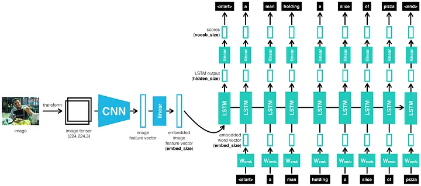

# Image captioning 
Image Captioning is the process of generating textual description of an image. It uses both Natural Language Processing and Computer Vision to generate the captions.

# Architecture 

the architecture used for training this model is encoder decoder architecture in which we are using pretrained CNN for generating embddings for images and using RNN decoder for training further. model is trained on flickr8k dataset. 

# How to train model 
 install requirements 
       
       pip install -r requirements.txt 
 run 
       
       python3 train.py
# link to website 
